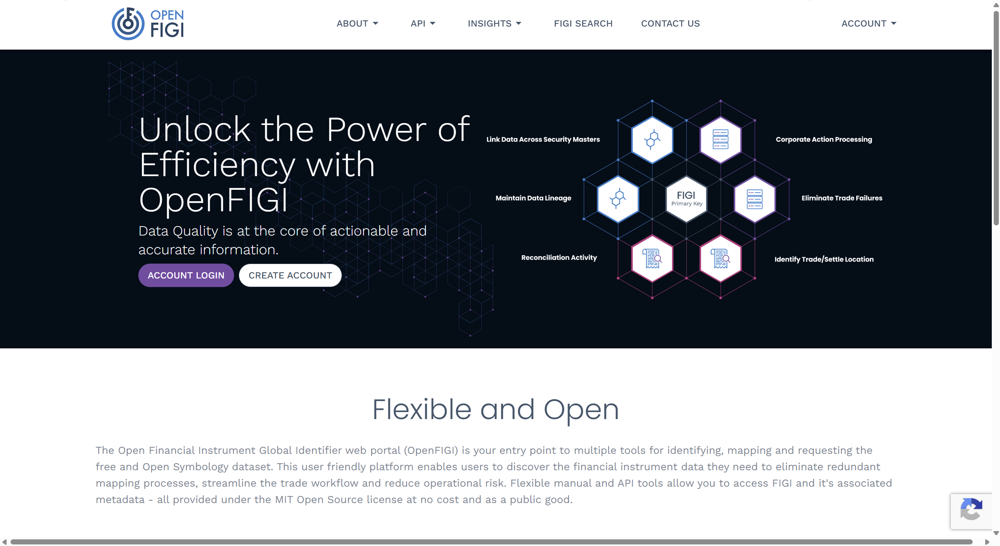
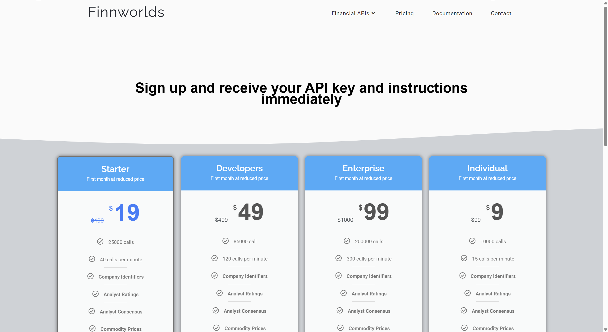
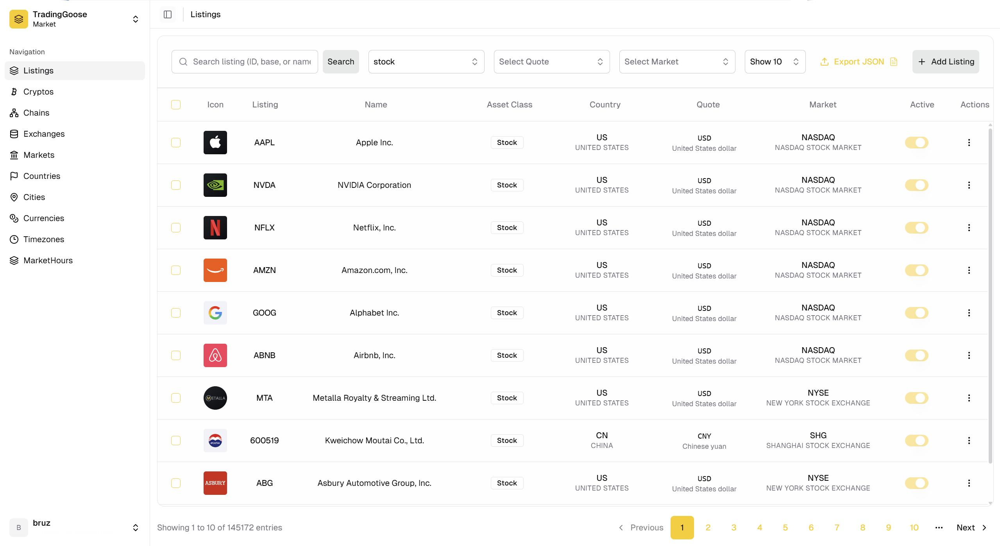
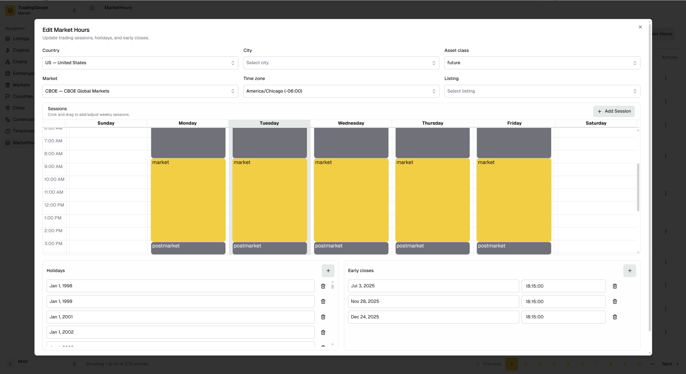

When we started TradingGoose, the first thing we needed was market data. That sounds simple: pick a provider, call an API, move on.

It stopped being simple as soon as we wanted more than one provider. We wanted connectors for Alpaca, Yahoo Finance, Alpha Vantage, Finnhub, and others so users could switch sources or use more than one source at a time.

The first problem we ran into was not rate limits or latency. It was identity.

## The Cross-Platform Identity Problem

Every provider names the same asset differently. US equities are the easy case. Outside that, the mapping gets messy fast.

A Shanghai listing might be:

- `601988.SS` on Yahoo Finance
- `601988.SHG` on Finnhub
- `601988` on Alpha Vantage, with the exchange passed separately

Forex is similar:

- `EURUSD=X` on Yahoo Finance
- `OANDA:EUR_USD` on Finnhub

Crypto is worse:

- `BTC/USD` on Alpaca
- `BTC-USD` on Yahoo Finance
- `BINANCE:BTCUSD` on Finnhub
- `BTCUSD` on Alpha Vantage

Some providers use postfixes like `^`, `.ETF`, or `=X`. Some prepend exchange identifiers like `OANDA:`. Some remove delimiters entirely.

Once you support more than one source, string munging stops being a detail and becomes the thing you spend time debugging.

What we wanted was one shared identity per listing, plus a way to translate that identity into whatever each provider expects.

The part that ended up being more useful than plain symbol translation was the rest of the market model around it. We group segment MICs into a single `Market` entity, then keep trading hours, holiday closures, and early closes as structured data. That made the shared identity layer useful as a source of truth, not just a ticker lookup table.

## What Existing Projects Do

We were not the first people to hit this problem.

### CCXT

CCXT normalizes crypto pairs into `BASE/QUOTE`. That gives you a common shape across exchanges, but it still relies on per-exchange dictionaries for odd codes and manual updates when an exchange changes something.

That works inside crypto. It does not give you:

- a model for equities, forex, indices, or ETFs
- a persistent identity layer
- a UI for curating mappings
- a self-hostable service for the rest of the stack

It also leans on global market settings in places like spot versus derivatives, which gets awkward when the same exchange ID can map to more than one market type.

### LEAN

LEAN goes in the opposite direction. It gives every security an immutable `SecurityIdentifier`, then uses map files and brokerage-specific mappers to translate between canonical symbols and platform tickers.

That is a solid design, but it still comes with a lot of manual structure:

- hardcoded market definitions
- hardcoded exchange definitions
- per-symbol map files for changes and delistings
- large CSV tables with a lot of empty override fields
- no built-in universal identifier resolver in the core identity layer

Both systems solve real problems. Neither gave us a manageable, self-hostable place to curate identity across asset classes and data sources.

## Why Hosted Services Were Not Enough

We also looked at hosted options.

OpenFIGI was the closest fit for identity mapping, but it is still a hosted service. We wanted something we could own, extend, and adapt to our own data model.

FinnWorlds has useful market metadata, but the closed-source constraints made it a poor fit for a small self-hosted system.

The issue was not feature count. It was control. We did not want the core identity layer to depend on someone else's limits, schema choices, or uptime.





We did not find an open-source project that covered the full shape we wanted.

## How We Designed It

### First Attempt: MIC-Based Exchange Mapping

Our first design centered on the Market Identifier Code (MIC) standard. Every exchange has an operating MIC, and many have segment MICs underneath it. That gives you a real-world anchor for mapping listings, trading hours, and geographic metadata.

The problem is that MICs are more granular than we needed. Many segment MICs under the same operating MIC share the same hours, the same location, and the same practical behavior. Treating each segment separately added work without changing the result.

So we introduced a `Market` entity: a higher-level grouping with a short code like `NYSE`, `NASDAQ`, `LSE`, or `SHG`. The loader finds the operating MIC, walks the parent tree, collects the descendants, and assigns them to the same market.

That simplified the model to `listing -> market -> data source` instead of `listing -> MIC -> data source`. The individual MICs still exist and are queryable, but trading hours and mapping rules operate at the market level.

### Move Provider-Specific Formatting to the Client

The next design choice was the boundary between server and client.

At first, we planned to let TradingGoose Market translate `AAPL` into `AAPL.US` for Finnhub, `0700.HK` for Yahoo Finance, and so on. That turned out to be the wrong boundary. The server should know what a listing is. The client should know how a provider spells it.

Provider-specific formatting changes when you add or remove a source, and different clients may use different providers. So we moved symbol rules out of the server and into the client.

In TradingGoose Studio, each data provider defines a set of symbol rules:

```typescript
interface MarketSymbolRule {
  assetClass?: AssetClass;
  market?: string;
  country?: string;
  city?: string;
  currency?: string;
  regex?: string;
  template: string;
  active?: boolean;
}
```

Each provider also registers a precedence list that tells the matcher which fields matter most for a given asset class:

```typescript
rulePrecedence: {
  default: ['market', 'currency', 'assetClass', 'country', 'city', 'listing'],
  stock:   ['market', 'currency', 'country', 'city', 'listing'],
  crypto:  ['currency', 'market', 'country', 'city', 'listing'],
  currency:['currency', 'market', 'country', 'city', 'listing'],
}
```

For equities, `market` usually matters most. For crypto and currency pairs, `currency` often matters more. The scorer uses that ordering to pick the most specific match.

#### How Rule Resolution Works

When Studio needs data for a listing, it runs four steps:

1. Build a `ListingContext` from the stored listing record.
2. Filter active rules that match the scope fields.
3. Score the matches by precedence.
4. Render the winning template.

The score is simple: for each scope field a rule specifies, add `precedence.length - index` where `index` is that field's position in the precedence list. Fields earlier in the list carry more weight. A `regex` rule gets a small tiebreaker bonus.

For stock precedence `['market', 'currency', 'country', 'city', 'listing']`, the numbers look like this:

| Rule | Score |
|------|------:|
| `{ market: 'NYSE', template: '{base}' }` | 5 |
| `{ country: 'HK', template: '{base}.HK' }` | 3 |
| `{ market: 'HKEX', country: 'HK', template: '{base}.HK' }` | 8 |
| `{ template: '{base}' }` | 0 |

The highest score wins. A rule that specifies both `market` and `country` beats a rule that only specifies `market`, which beats the catch-all fallback.

#### Rules in Practice

Here is the same listing rendered three different ways:

```typescript
// Yahoo Finance
{ city: 'SHANGHAI', template: '{base}.ss' }                     // 601988 -> 601988.ss
{ city: 'SHENZHEN', template: '{base}.sz' }                     // 000858 -> 000858.sz
{ assetClass: 'stock', market: 'HKEX', template: '{base}.HK' }  // 0700 -> 0700.HK
{ assetClass: 'crypto', template: '{base}-{quote}' }            // BTC -> BTC-USD
{ assetClass: 'currency', template: '{base}{quote}=X' }         // EUR -> EURUSD=X
{ template: '{base}' }                                          // AAPL -> AAPL

// Finnhub
{ assetClass: 'currency', template: 'OANDA:{base}_{quote}' }    // EUR -> OANDA:EUR_USD
{ assetClass: 'crypto', template: 'BINANCE:{base}{quote}' }     // BTC -> BINANCE:BTCUSD
{ market: 'NYSE', template: '{base}' }                          // AAPL -> AAPL
{ template: '{base}{exchangeSuffix}' }                          // VOD -> VOD.L

// Alpaca
{ assetClass: 'crypto', template: '{base}/{quote}' }            // BTC -> BTC/USD
{ market: 'NYSE', template: '{base}' }                          // AAPL -> AAPL
{ template: '{base}' }                                          // fallback
```

The same listing - say, Bitcoin quoted in USD - resolves to `BTC-USD` for Yahoo, `BINANCE:BTCUSD` for Finnhub, and `BTC/USD` for Alpaca. The shared identity stays the same. Only the rendered symbol changes per provider.

#### Why Inbound Data Does Not Need Reverse Mapping

The key point is that the shared context stays intact throughout the request/response cycle.

When Studio sends a request for `601988.ss` to Yahoo Finance, it already knows that the request came from listing `TG_LSTG_XXXX`. The response data is attached back to that listing directly. There is no need to parse `601988.ss` and infer what it meant.

That means adding a new provider does not require changes in TradingGoose Market. You define a new set of rules in the client, and the shared identity layer stays untouched.

## What TradingGoose Market Does Now

TradingGoose Market is a self-hostable market-data service with a shared identity layer. It stores listings, exchanges, markets, cryptocurrencies, currencies, countries, cities, timezones, blockchain networks, and trading hours, and exposes them through an admin UI and a versioned API.



The current stack is straightforward: Next.js 16 on Bun, PostgreSQL with Drizzle, Better Auth for sessions, and shadcn/ui for the admin interface.

### Beyond Ticker Identity: Trading Hours, Holidays, and Early Closes

Once we had a relational system linking listings to markets, countries, cities, and timezones, trading hours became the next obvious thing to store.

TradingGoose Market keeps regular sessions, holiday closures, and early closes as structured data. The admin UI shows a weekly calendar for each market, and overrides can be scoped by market, country, asset class, or even a single listing when needed.



The market-level grouping matters here too. Instead of maintaining a separate schedule for every segment MIC under NYSE, we configure the market once and apply it everywhere. If a specific asset class needs different hours, we add a narrower override and let the resolver pick the most specific match.

## Closing

The tradeoff is simple: we take on the database and admin UI ourselves, but we keep the shared identity layer under our control.

For anything that talks to more than one market data provider, that has turned out to be the part worth keeping boring.
